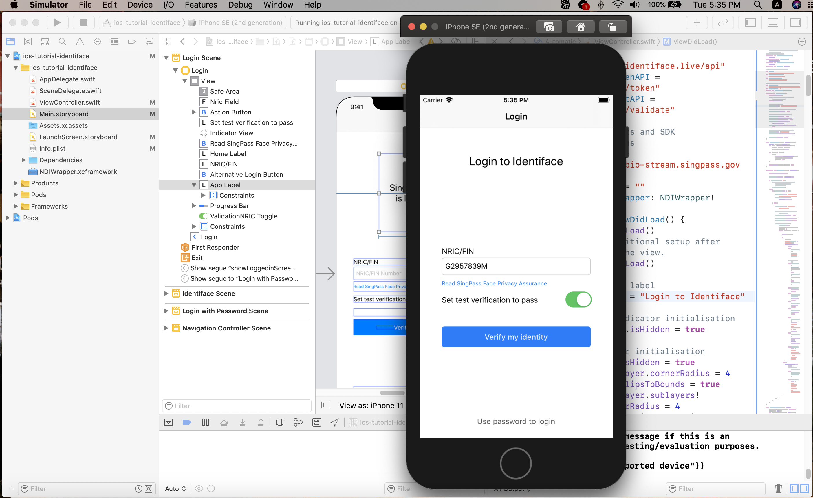
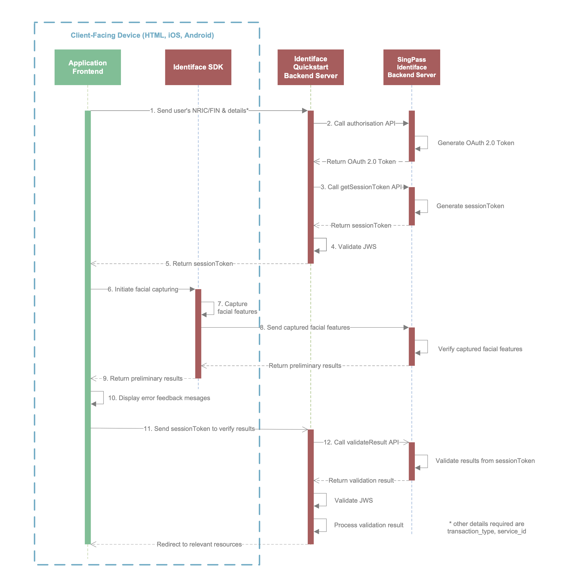
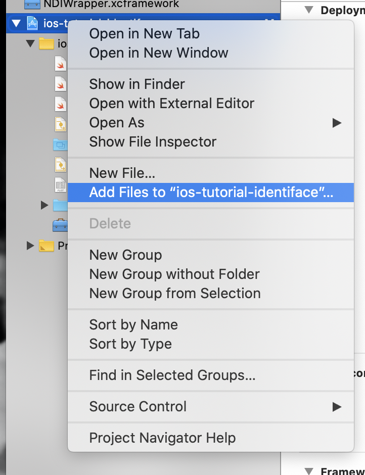
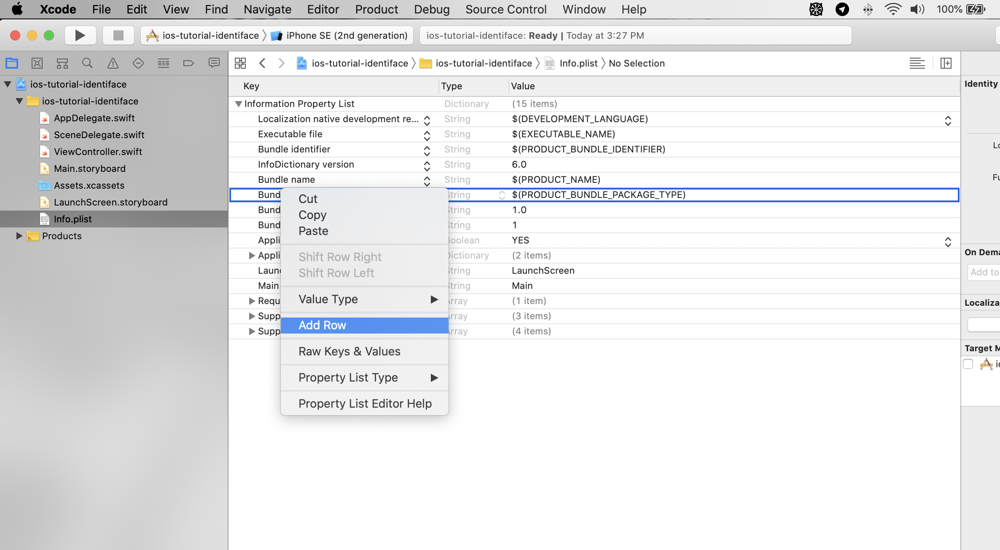
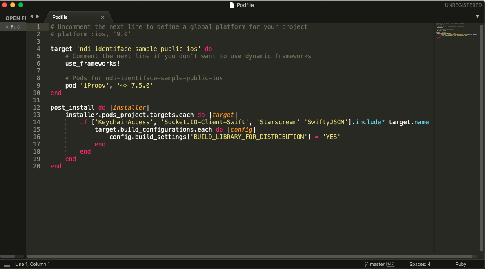
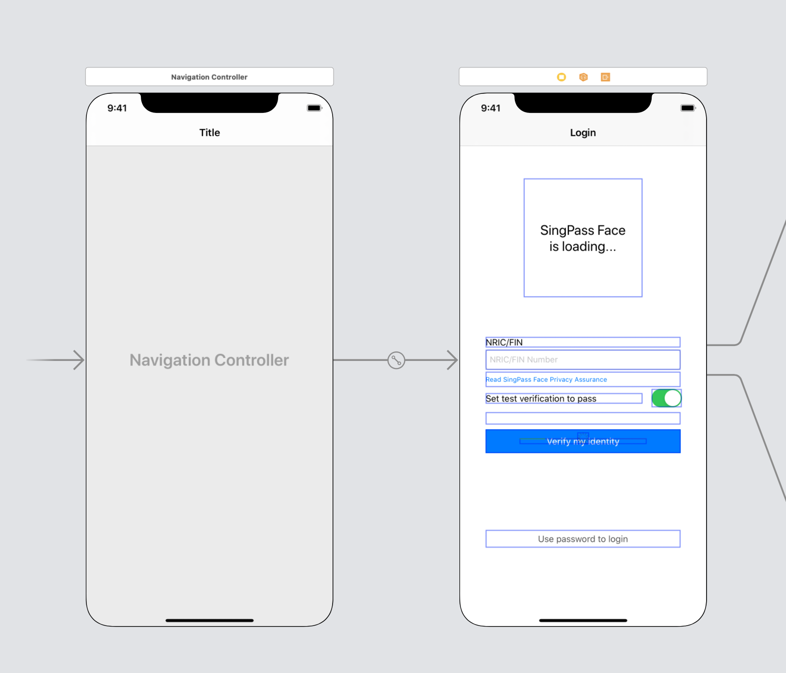
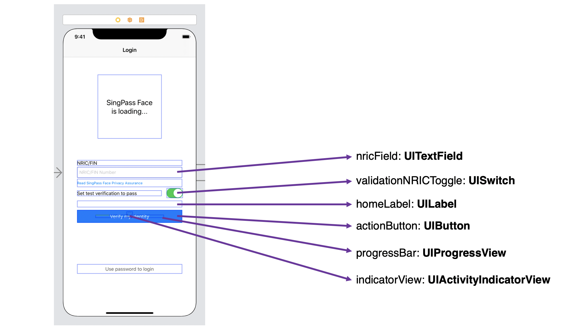

# NDI Identiface QuickStart
NDI Identiface Sample iOS App for Developers' Onboarding reference.



Made with Swift 5.2.4 on Xcode

----

# QuickStart :rocket:

In this section, you will be introduced to Identiface QuickStart that allows you to prototype quickly with our biometrics service, as well as step-by-step tutorials to help you understand the flow – **without implementing the backend**.

All you have to do is to configure your frontend to include the Identiface SDK, as depicted below in **green**:



> README
> We will assume that you have some experience in using **Xcode** and **Swift**. Please ensure that you also have an [Apple Developer](https://developer.apple.com/) account to test the full features of the Identiface SDK on your iOS Device.
>
> **Check that you have the minimum requirements on your iOS Device:**
>
> * iOS 13.0 and above

## Creating a new project in Xcode

In this QuickStart, we encourage you to create a new Xcode project to reduce the complications and assist you in understanding how to integrate Identiface better.

Start by creating a new "Single Page Application". Set your language to `Swift` and your User Interface to `Storyboard`.

**_We do not need Unit/UI Tests nor Core Data._**

## Setting up the SDK in Xcode

### Adding dependency files

Firstly, [download the SDK pack](https://bio-face.s3-ap-southeast-1.amazonaws.com/ios-sdk/ndi-fbs-ios-sdk.zip) and extract the dependencies from "FrameworkAndDependencies".

Add the `NDIWrapper.xcframework` and `Dependencies` folders into your project, as illustrated below:



### Camera usage setup

In your Xcode file explorer, go to your Project > `info.plist`. In there, add the key `NSCameraUsageDescription` into your info.plist. This will result in _"Privacy – Camera Usage Description"._

For the value, we **recommend** you to use:

 _"We need permissions to continue. Please allow SingPass Face to access your camera."_

Here's how to add into your Info.plist:



## Setting up SDK Dependencies

We will be using [Cocapods](https://guides.cocoapods.org/using/getting-started.html#installation) to import the dependencies in this QuickStart tutorial, but feel free if you wish to approach it with any other way.

Navigate to your Xcode project folder (the folder that houses the `.xcodeproj` file) in `Terminal`, and create a new Podfile by using the command `pod init`. Once done, open up the `Podfile` with a code editor of your choice.

Insert the following to your Podfile under the `target` section:

```ruby
pod 'iProov', '~> 7.5.0'
```

And add the following to the bottom of your `Podfile`:

```ruby
post_install do |installer|
    installer.pods_project.targets.each do |target|
      if ['KeychainAccess', 'Socket.IO-Client-Swift', 'Starscream' 'SwiftyJSON'].include? target.name
        target.build_configurations.each do |config|
            config.build_settings['BUILD_LIBRARY_FOR_DISTRIBUTION'] = 'YES'
        end
      end
    end
end
```

> ⚠ IMPORTANT
> This code will manually enable module stability for some dependencies due to some modules not directly supported in Cocoapods. Once Cocoapods supports these modules, this workaround can be removed.

<br />

**Your file should look like this:**



Once done, save the `Podfile`. In `Terminal`, run the following commands: `pod install` or `pod install --verbose`.

> IMPORTANT
> Now that you've installed the dependencies, please restart Xcode, and subsequently open your project with **`.xcworkspace`** and **not `.xcodeproj`**.

## The Storyboard and View Controllers

### Setting up the Storyboard

For this tutorial, the `ViewController.swift` file is the app's main entry point, and where the Identiface SDK will be launched from.

**Please download our Storyboard files [here](https://github.com/theodorayy/ndi-identiface-sample-public-ios/blob/master/ndi-identiface-sample-public-ios/Base.lproj) and paste both files into your `<your_app>\Base.lproj` folder**

This is how our storyboard looks like:



> TIP
> Notice the NRIC/FIN text field. We will use this in the `ViewController.swift`.

### Importing the SDK and JSON Library

Include the following code in `ViewController` to import the SDK and `SwiftyJSON`:

```swift
import NDIWrapper
import SwiftyJSON
```

### Set up LoggedIn View Controller

Create a new Swift file, and title it "LoggedIn.swift".

Paste the following code into `LoggedIn.swift`:

```swift
import UIKit

class LoggedIn: UIViewController {
    
    @IBOutlet var welcomeLabel: UILabel!
    @IBOutlet var logoutButton: UIButton!
    
    var userID: String!
    
    override func viewDidLoad() {
        super.viewDidLoad()
        welcomeLabel.text = "Welcome, " + userID + "!"
        self.navigationItem.hidesBackButton = true
    }
    
    @IBAction func logout(_ sender: UIButton) {
        let _ = self.navigationController?.popViewController(animated: true)
    }
    
}
```

### Set up the main View Controller

Set up the following variables in the `ViewController.swift` file:

```swift
class ViewController: UIViewController {
    
    // UI Outlets
    @IBOutlet var homeLabel: UILabel!
    @IBOutlet var nricField: UITextField!
    @IBOutlet var actionButton: UIButton!
    @IBOutlet weak var indicatorView: UIActivityIndicatorView!
    // validationNRICToggle: toggle between NRICs that will either return
    // a pass or fail matching for testing purposes
    @IBOutlet var validationNRICToggle: UISwitch!
    @IBOutlet weak var progressBar: UIProgressView!
...
```

**and connect your input fields**:




### Declare important variables

In your `ViewController`, declare the following URL as variables for our QuickStart backend API:

```swift
    // Identiface QuickStart API
    let baseURL = "https://www.identiface.live/api"
    let getSessionTokenAPI = "/face/verify/token"
    let validateResultAPI = "/face/verify/validate"
```

Also add the following SDK variables:

```swift
    // SingPass servers and SDK initialisations
    let streamingURL = "https://stg-bio-stream.singpass.gov.sg"
    var sessionToken = ""
    private var ndiWrapper: NDIWrapper!
```

### Configuring actions after View Controller loads

Include the following in `viewDidLoad()`:

```swift
    override func viewDidLoad() {
        super.viewDidLoad()

        // app header label
        appLabel.text = "Login to Identiface"
        
        // loading indicator initialisation
        indicatorView.isHidden = true
        
        // progressBar initialisation
        progressBar.isHidden = true
        progressBar.layer.cornerRadius = 4
        progressBar.clipsToBounds = true
        progressBar.layer.sublayers![1].cornerRadius = 4
        progressBar.subviews[1].clipsToBounds = true
        
        // set an NRIC for quick testing
        nricField.text = "G2957839M"
        actionButton.layer.cornerRadius = 5
        
        nricField.isEnabled = true
    }
```

and after `viewDidLoad()`:

```swift
    override func prepare(for segue: UIStoryboardSegue, sender: Any?) {
        if (segue.identifier == "showLoggedinScreen") {
            let loggedInVC = segue.destination as! LoggedIn
            loggedInVC.userID = nricField.text
        }
    }

    func alertCreator(title: String, message: String, actions: [String]) {
        let alert = UIAlertController(title: title, message: message, preferredStyle: .alert)
        
        for action in actions {
            alert.addAction(UIAlertAction(title: action, style: .default, handler: nil))
        }
        
        self.present(alert, animated: true)
    }

    @IBAction func toggleNRIC(sender: UISwitch) {
        print(sender.isOn)
        nricField.text = sender.isOn ? "G2957839M" : "G2834561K"
    }
```

## Configuring button actions

The `loadFace()` function is triggered whenever the `actionButton` is pressed, or when the user hits the "Go" key on the keyboard after keying in the NRIC/FIN input field. This will allow you to do the following steps in sequence:

1. If `getSessionToken()` is not called yet, perform the `getSessionToken()` which will retrieve the `sessionToken`. More on `getSessionToken()` later on.
2. Once called, the variable `sessionToken` will not be empty. So if the actionButton is tapped again, it will launch and handle the face verification process instead through the function `sdkDidInitialise()`. More on this later on.

Copy the following to your `ViewController`:

```swift
    @IBAction func loadFace(sender: AnyObject) {
        
        self.view.endEditing(true)
        
        homeLabel.textColor = UIColor.black
        
        if (sessionToken != "") {
            // if the sessionToken is not empty, begin the SDK initialisation
            sdkDidInitialise()
        } else {
            if (nricField.text == "") {
                
                homeLabel.text = "Key in your NRIC/FIN number above."
                homeLabel.textColor = UIColor.systemRed
                
            } else {
                
                homeLabel.text = "Verifying your NRIC..."
                
                // hide actionButton when no input errors
                actionButton.isHidden = true
                
                indicatorView.startAnimating()
                indicatorView.isHidden = false
                
                getSessionToken(nric: nricField.text!, sessionCompletionHandler: {response in
                    if let response = response {
                        
                        print(response)
                        
                        if (response["type"].string! == "success") {
                            DispatchQueue.main.async {
                                self.sessionToken = response["token"].string!
                                
                                // initialise SDK
                                self.ndiWrapper = NDIWrapper(streamingURL: self.streamingURL, sessionToken: self.sessionToken)

                                self.nricField.isEnabled = false
                                self.validationNRICToggle.isEnabled = false
                                self.actionButton.isHidden = false
                                self.indicatorView.isHidden = true
                                
                                self.actionButton.setTitle("Launch Face Verification", for: .normal)
                                self.actionButton.backgroundColor = UIColor.systemGreen
                                
                                self.homeLabel.text = "Let's begin face verification with SingPass Face."
                            }
                        } else {
                            DispatchQueue.main.async {
                                // clear the sessionToken
                                self.resetSDKInitialisation()
                                
                                self.homeLabel.text = "Your NRIC/FIN doesn't exist in our database..."
                            }
                        }
                    }
                })
            }
        }
    }
```

## Retrieve session token

From `loadFace()`, you might have noticed `getSessionToken()`. Recall from our sequence diagram that to initialise the SDK, we have to retrieve the sessionToken first. To do that, simply call our QuickStart backend for the sessionToken. 

Copy the following to `ViewController`:

```swift
    func getSessionToken(nric: String, sessionCompletionHandler: @escaping (JSON?) -> Void) {
        let getSessionTokenURL = URL(string: baseURL + getSessionTokenAPI)!
        
        let params: [String: Any] = [
            "service_id": "SingPass",
            "user_id": nric,
            "pw":"ndi-api"
        ]
        
        var request = URLRequest(url: getSessionTokenURL)
        request.httpMethod = "POST"
        request.setValue("application/json", forHTTPHeaderField: "Content-Type")
        guard let reqBody = try? JSONSerialization.data(withJSONObject: params, options: []) else {
            return
        }
        request.httpBody = reqBody
        request.timeoutInterval = 10
        
        let session = URLSession.shared
        
        print(request.httpBody!)
        
        let task = session.dataTask(with: request, completionHandler: {
            (data, response, error) in
            if let error = error {
                print("ERROR FETCH: \(error)")
            }
            
            if let response = response {
                print("RESPONSE: \(response)")
            }
            
            if let data = data {
                do {
                    let json = try JSON(data: data)
                    sessionCompletionHandler(json)
                } catch {
                    print(error)
                }
            }
        })
        
        task.resume()
        
    }
```

Below are the parameters for the request for your information:

**URL**

```
https://www.identiface.live/api/face/verify/token
```

<br>

**Parameters**

<table id="" class="">
    <thead>
        <tr>
            <td><b>Parameter</b></td>
            <td><b>Description</b></td>
        </tr>
    </thead>
    <tbody>
        <tr>
            <td>service_id</td>
            <td>Unique Service ID for your application. For this QuickStart, you will be using the example "SingPass". Note that you will obtain a <code>service_id</code> upon approval of your linkup request.</td>
        </tr>
        <tr>
            <td>user_id</td>
            <td>Your user's NRIC/FIN number. This will be used to verify that the user is a valid user of SingPass and has their biometrical data registered with the Government.</td>
        </tr>
        <tr>
            <td>pw</td>
            <td>This is the QuickStart secret, only for use in the QuickStart environment to protect our sample APIs. This is <b>NOT</b> part of the normal Identiface API flow.</td>
        </tr>
    </tbody>
</table>

<br>

> README
> Note that in the actual implementation, you will have to build the backend to perform this server-to-server call with our SingPass servers.

## Start face verification and handle results

Face verification results could be handled through a callback in `sdkDidInitialise()`. Copy the following code into your `ViewController`.

```swift
    func sdkDidInitialise() {
            
        ndiWrapper.launchBioAuth(streamingURL: self.streamingURL, sessionToken: self.sessionToken, callback: { (status) in

            DispatchQueue.main.async {
                self.actionButton.isHidden = true
                self.progressBar.isHidden = false
            }
            
            switch status {
            // Failure handler, will post alert messages based on feedback
            case .failure(reason: _, feedbackCode: let feedbackCode):
                
                // FORCE PASS MATCHING FOR G2957839M -- will always return pass no matter who tries to match this NRIC
                if (self.nricField.text == "G2957839M") {
                    self.validateResult(nric: self.nricField.text!, sessionToken: self.sessionToken, sessionCompletionHandler: { response in
                            if let response = response {
                                print("====")
                                print(response)
                                
                                if (response["is_passed"].string == "true") {
                                    DispatchQueue.main.async {
                                        self.performSegue(withIdentifier: "showLoggedinScreen", sender: nil)
                                    }
                                } else {
                                    DispatchQueue.main.async {
                                        self.alertCreator(title: "Unsuccessful", message: "Face verification was unsucessful", actions: ["Try again", "Cancel"])
                                    }
                                }
                                
                                DispatchQueue.main.async {
                                    self.resetSDKInitialisation()
                                }
                            }
                        }
                    )
                    break
                }
                
                // else
                print(status)
                DispatchQueue.main.async {
                    self.alertCreator(title: "Failed", message: feedbackCode, actions: ["ok"])
                    self.resetSDKInitialisation()
                    
                    self.actionButton.setTitle("Try again", for: .normal)
                    self.actionButton.backgroundColor = UIColor.systemBlue
                }
                break
            // Successful verification handler, next step is to call the validateResult API
            case .success(token: let token):
                if (token != self.sessionToken) {
                    let alert = UIAlertController(title: "Error", message: "Session Error. Please try again", preferredStyle: .alert)
                    
                    alert.addAction(UIAlertAction(title: "Ok", style: .default, handler: nil))
                    
                    self.present(alert, animated: true)
                    
                    DispatchQueue.main.async {
                        self.resetSDKInitialisation()
                    }
                } else {
                    DispatchQueue.main.async {
                        self.homeLabel.text = "Verifying with SingPass servers..."
                    }
                    
                    if (self.nricField.text == "G2957839M") {
                        DispatchQueue.main.async {
                            self.resetSDKInitialisation()
                            self.performSegue(withIdentifier: "showLoggedinScreen", sender: nil)
                        }
                        break
                    }
                    
                    self.validateResult(nric: self.nricField.text!, sessionToken: token, sessionCompletionHandler: { response in
                            if let response = response {
                                print("====")
                                print(response)
                                
                                if (response["is_passed"].bool!) {
                                    DispatchQueue.main.async {
                                        self.performSegue(withIdentifier: "showLoggedinScreen", sender: nil)
                                    }
                                } else {
                                    DispatchQueue.main.async {
                                        self.alertCreator(title: "Unsuccessful", message: "Face verification was unsucessful", actions: ["Try again", "Cancel"])
                                    }
                                }
                                
                                // Reset SDK
                                
                                DispatchQueue.main.async {
                                    self.resetSDKInitialisation()
                                }
                            }
                        }
                    )
                }
                break
            case .error(error: let error):
                print("ERROR!")
                print(error)
                self.alertCreator(title: "Error", message: error.localizedDescription, actions: ["Ok"])
                DispatchQueue.main.async {
                    self.resetSDKInitialisation()
                }
                break
            case .processing(progress: let progress, message: let progressMessage):
                DispatchQueue.main.async {
                    self.homeLabel.text = progressMessage
                    self.progressBar.setProgress(Float(progress), animated: true)
                    print(Float(progress))
                }
                break
            default:
                print(status)
                break
            }
        })
        
    }
```

From the above code, if the face verification result is `.successful`, call `validateResult()`.

Copy the following code into `ViewController`:

```swift
    func validateResult(nric: String, sessionToken: String, sessionCompletionHandler: @escaping (JSON?) -> Void) {
           let validateResultURL = URL(string: baseURL + validateResultAPI)!
           
           let params: [String: Any] = [
               "service_id": "SingPass",
               "user_id": nric,
               "pw":"ndi-api",
               "token": sessionToken
           ]
           
           var request = URLRequest(url: validateResultURL)
           request.httpMethod = "POST"
           request.setValue("application/json", forHTTPHeaderField: "Content-Type")
           guard let reqBody = try? JSONSerialization.data(withJSONObject: params, options: []) else {
               return
           }
           request.httpBody = reqBody
           request.timeoutInterval = 10
           
           let session = URLSession.shared
           
           print(request.httpBody!)
           
           let task = session.dataTask(with: request, completionHandler: {
               (data, response, error) in
               if let error = error {
                   print("ERROR FETCH: \(error)")
               }
               
               if let response = response {
                   print("RESPONSE: \(response)")
               }
               
               if let data = data {
                   do {
                       let json = try JSON(data: data)
                       sessionCompletionHandler(json)
                   } catch {
                       print(error)
                   }
               }
           })
           
           task.resume()
    }
```

Also add the following snippet to reset the SDK:

```swift
    func resetSDKInitialisation() {
        self.sessionToken = ""
        
        self.actionButton.setTitle("Verify my identity", for: .normal)
        self.actionButton.backgroundColor = UIColor.systemBlue
        
        self.homeLabel.text = ""
        
        
        self.nricField.isEnabled = true
        self.validationNRICToggle.isEnabled = true
        self.actionButton.isHidden = false
        self.progressBar.isHidden = true
    }
```

For your information, below are the parameters for the request to the `validateResult` API:

**URL**

```
https://www.identiface.live/api/face/verify/validate
```

<br>

**Parameters**

<div>
    <table >
        <thead>
            <tr>
                <td><b>Parameter</b></td>
                <td><b>Description</b></td>
            </tr>
        </thead>
        <tbody>
            <tr>
                <td>service_id</td>
                <td>Unique Service ID for your application. For this QuickStart, you will be using the example "SingPass". Note that you will obtain your Service ID upon approval of your linkup request.</td>
            </tr>
            <tr>
                <td>user_id</td>
                <td>Your user's NRIC/FIN number. This will be used to verify that the user is a valid user of SingPass and has their biometrical data registered with the Government.</td>
            </tr>
            <tr>
                <td>pw</td>
                <td>This is the QuickStart secret, only for use in the QuickStart environment. This is <b>NOT</b> part of the normal Identiface API flow.</td>
            </tr>
            <tr>
                <td>token</td>
                <td>This is the <code>sessionToken</code>.</td>
            </tr>
        </tbody>
    </table>

</div>

<br>

## Final notes

Congratulations, you've successfully created a Proof-of-Concept (PoC) using the Identiface iOS QuickStart!

You're now ready to integrate the SDK into your test environments using the QuickStart backend APIs.
